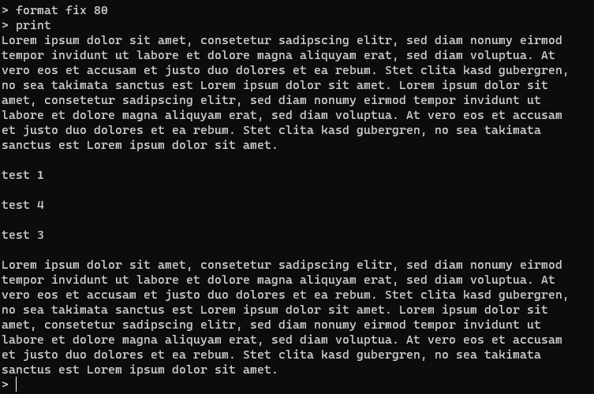
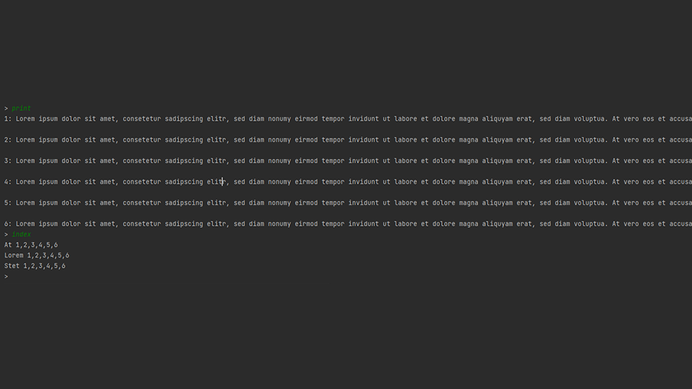

This console notepad is a university project.

Its a notepad controlled in a console entierly written in Java. \
You can add lines, delete lines, add a pre defined dummy text, print the lines in a defined format and index words.

## Commands

### ADD

**ADD [n]**

Calls up the input of the text for the paragraph after entering this command. The paragraph is inserted at position n. If the paragraph number is missing, it is added at the end.


### DEL

**DEL [n]**

Deletes a paragraph. If the paragraph number is missing, the last paragraph is deleted.


### DUMMY

**DUMMY [n]**

Inserts a permanently programmed dummy text. If no paragraph number n is specified, the paragraph is added at the end.


### PRINT

**PRINT**

Output of the text according to the currently set output format.


### FORMAT

**FORMAT RAW**

Sets the output format to the output of paragraphs preceded by paragraph numbers. This is the default behavior.
Output format:
```
<1>: <text>
...
<n>: <text>
```


**FORMAT FIX**

Sets the output format to an output with a maximum column width of b characters. The wrap behavior is as follows:
- Wrapping is only allowed after a space.
- The space character after which the line is wrapped does not count towards the line length. It is still output on the current line, even if it may no longer fit on it.
- If there is no break within the column width after a break, you can break after the column width.



### REPLACE

**REPLACE [n]**

After entering this command, first calls up the input of a word or text part to be searched for
or part of the text to be searched for in paragraph n and then to enter the text with which the
is to be replaced with. The search and replace is carried out per paragraph, not across
across paragraph boundaries. If no paragraph number n is specified, the last paragraph
is changed.


### INDEX

**INDEX**

Outputs an index (word index) of all terms that occur more than three times across all paragraphs.
than three times across all paragraphs. A term begins with a capital letter. The index lists
the paragraphs in which the respective term occurs as a comma-separated sequence of numbers.
separated by a comma.



### EXIT

**EXIT**

Exits the program.


### Error handling

