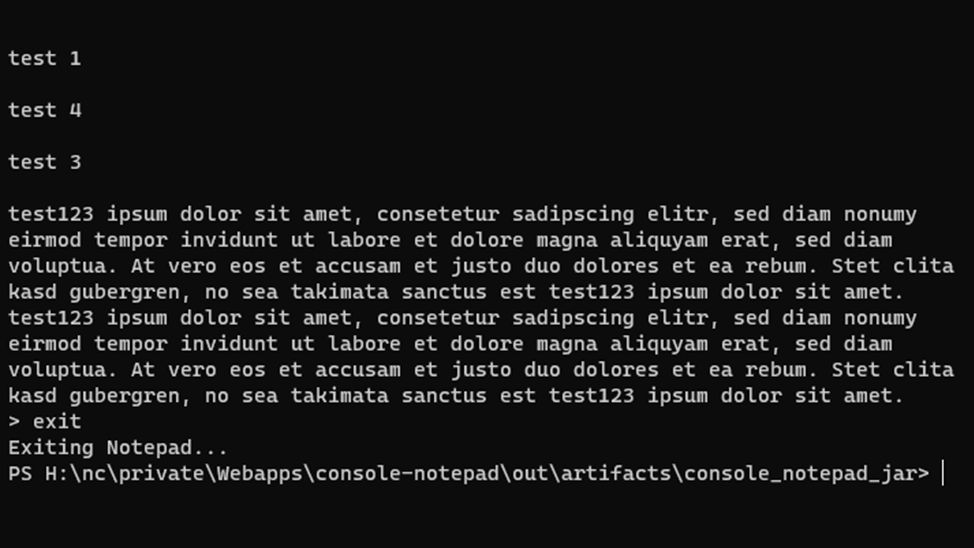

# Commands
## ADD
- ADD [n]

inputs are filtered

Adds a paragraph on line n, if no line number is given, add a new at the bottom

## DEL
- DEL [n]

Deletes line n, if no line number is given, remove the last line

## DUMMY
- DUMMY [n]

Adds a pre-defined dummy text on line n, if no line number is given, add a new line at the bottom

## FORMAT
- format raw
- format fix <b>

Change format of print
- fix = no line numbering, linebreak on b'th character
- raw = no line breaks, with line numbering

## REPLACE
- REPLACE [n]

inputs are filtered

Replaces a word or phrase on line n, if no line number is given, replace words in the last line

## INDEX
- INDEX

?????

TODO:

## EXIT
- EXIT

exits program

# Error handling

All foreseen errors are handled.

Example:

